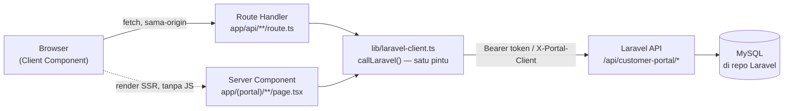

# Portal Pelanggan — Whusnet

Aplikasi web **Backend-for-Frontend (BFF)** berbasis Next.js (App Router)
untuk pelanggan ISP Whusnet melihat tagihan, pembayaran, saldo, dan tiket
keluhan mereka sendiri. Repo ini **tidak punya database sendiri** — semua
data dan business logic hidup di API Laravel (`whusnet-operasional`, repo
terpisah), diakses lewat `/api/customer-portal/*`.

Selain pelanggan, repo ini juga melayani dua peran **staf lapangan** lewat
scan QR fisik (bukan login manual): **kolektor** (mencatat pembayaran
tunai/transfer di lokasi) dan **staf pembuat tiket** (membuat tiket
keluhan/pemasangan atas nama pelanggan yang di-scan).

> ⚠️ **Sebelum menulis kode apa pun**, baca [`AGENTS.md`](./AGENTS.md) —
> versi Next.js di sini punya breaking changes dari apa yang mungkin sudah
> kamu tahu. Dokumentasinya ada di `node_modules/next/dist/docs/`.

## Daftar Isi

- [Ringkasan Arsitektur](#ringkasan-arsitektur)
- [Menjalankan Secara Lokal](#menjalankan-secara-lokal)
- [Environment Variables](#environment-variables)
- [Struktur Folder](#struktur-folder)
- [Konvensi Wajib](#konvensi-wajib)
- [Skrip npm](#skrip-npm)
- [Docker](#docker)
- [Dokumentasi Lengkap](#dokumentasi-lengkap)

## Ringkasan Arsitektur

Next.js berperan sebagai **Backend-for-Frontend**: browser tidak pernah
bicara langsung ke Laravel. Semua panggilan API lewat Route Handler
(`app/api/**/route.ts`) atau langsung dari Server Component.



Alasan utamanya keamanan token: `access_token`/`refresh_token` disimpan di
cookie `httpOnly` (`portal_session`, di-encode `iron-session`) — tidak
pernah tersentuh JavaScript browser.

| Peran | Cara masuk | Halaman |
|---|---|---|
| Pelanggan | Aktivasi (`login_id`+PIN dari kartu QR) lalu login password | `/login`, `/aktivasi`, `/dashboard`, `/tagihan`, `/pembayaran`, `/saldo`, `/tiket`, `/profil` |
| Tamu scan QR | Scan QR kartu pelanggan → redirect otomatis | `/klaim?code=` |
| Staf kolektor | Scan QR dari app Operasional, token one-shot di URL | `/staff/kolektor?code=&staff_token=` |
| Staf tiket | Scan QR dari app Operasional, token one-shot di URL | `/staff/tickets?code=&staff_token=` |

Penjelasan lengkap tiap domain (auth, tagihan, pembayaran, saldo, tiket,
alur staf), diagram user flow, dan spesifikasi tiap halaman ada di
[`docs/DOKUMENTASI-PROJEK.md`](./docs/DOKUMENTASI-PROJEK.md).

## Menjalankan Secara Lokal

Butuh Node.js 24+ dan API `whusnet-operasional` yang sudah jalan (repo ini
tidak bisa berdiri sendiri — semua data dari sana).

```bash
npm install
npm run dev
```

Buka [http://localhost:3000](http://localhost:3000).

## Environment Variables

Buat `.env.local` (tidak ikut commit) dengan:

```env
LARAVEL_API_URL=http://localhost:8000/api/customer-portal
PORTAL_CLIENT_SECRET=<sama dengan PORTAL_CLIENT_SECRET di Laravel>
SESSION_COOKIE_SECRET=<untuk sign/encode cookie sesi, generate sendiri, ≥32 karakter>
```

Ketiganya **hanya** dibaca dari Route Handler/Server Component (server-side)
— jangan pernah diprefix `NEXT_PUBLIC_`, dan jangan pernah difetch langsung
dari Client Component.

## Struktur Folder

```
src/
  app/
    (auth)/          layout tanpa nav — login, aktivasi, klaim (resolve QR)
    (portal)/        layout berauth — sidebar desktop + bottom nav mobile
    (print)/         layout terpisah, print-friendly — kwitansi
    (staff)/staff/   layout tanpa nav, khusus token one-shot QR staf
    api/             Route Handler — proxy tipis ke Laravel
  components/        komponen shared (StatusBadge, MoneyDisplay, DateDisplay,
                      Pagination, EmptyState, ErrorBanner, SkeletonRows, dst)
  lib/
    laravel-client.ts   satu-satunya pintu fetch ke Laravel (auth, refresh-on-401)
    session.ts          baca/tulis/hapus cookie sesi (iron-session)
    types/portal-api.ts  kontrak tipe — turunan business-logic.md Laravel
  proxy.ts           gerbang cookie sebelum render (dulu middleware.ts)
```

## Konvensi Wajib

Ringkas — daftar lengkap ada di §9 `docs/DOKUMENTASI-PROJEK.md`:

1. **Tidak boleh** ada database/ORM sisi Next.js — semua data dari Laravel.
2. Env rahasia **tidak boleh** diprefix `NEXT_PUBLIC_`.
3. Token **tidak boleh** disimpan `localStorage` atau cookie non-`httpOnly`.
4. Client Component **tidak boleh** `fetch()` langsung ke `LARAVEL_API_URL`
   — selalu lewat Route Handler sendiri.
5. Semua panggilan ke Laravel lewat `lib/laravel-client.ts`.
6. Label status Indonesia tidak di-hardcode ulang — pakai `label` dari API.
7. 404 "tidak ada" vs "milik pelanggan lain" tidak dibedakan tampilannya
   (anti-enumeration).
8. Nominal uang tidak disimpan sebagai `number`/`float` di state — selalu
   string desimal dari backend, diparse hanya saat format tampilan.
9. Tidak membuat UI untuk fitur yang endpoint-nya belum ada.
10. Tidak ada rute publik "lihat tagihan tanpa akun" di Portal ini.

## Docker

`Dockerfile` (multi-stage: deps → builder → runner, output `standalone`)
dan `docker-compose.yaml` ada di root repo. Container ini diharapkan jalan
di **network Docker yang sama** dengan `whusnet-operasional` (lihat komentar
`networks.whusnet_network` di `docker-compose.yaml`) — Next.js memanggil
Laravel lewat nama container, bukan `localhost`.

```bash
docker compose up
```

## Dokumentasi Lengkap

- [`AGENTS.md`](./AGENTS.md) — catatan penting versi Next.js yang dipakai
  (breaking changes dari versi umum), wajib dibaca sebelum ubah kode.
- [`docs/DOKUMENTASI-PROJEK.md`](./docs/DOKUMENTASI-PROJEK.md) — dokumentasi
  utama: arsitektur, business logic per domain, user flow (diagram),
  auth & siklus sesi, peta route ↔ endpoint Laravel, model data, spesifikasi
  tiap halaman, tabel kode error, dan detail tiap komponen.
- [`frontend-nextjs-rancangan.md`](./frontend-nextjs-rancangan.md) —
  blueprint/rancangan awal proyek.
- [`docs/api/postman/`](./docs/api/postman/) — koleksi Postman API.
