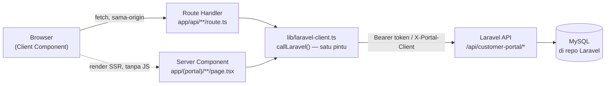
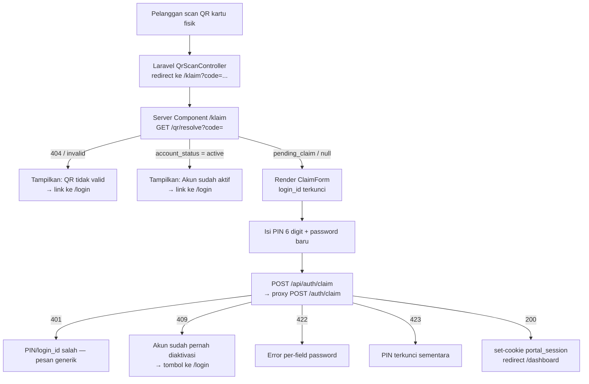
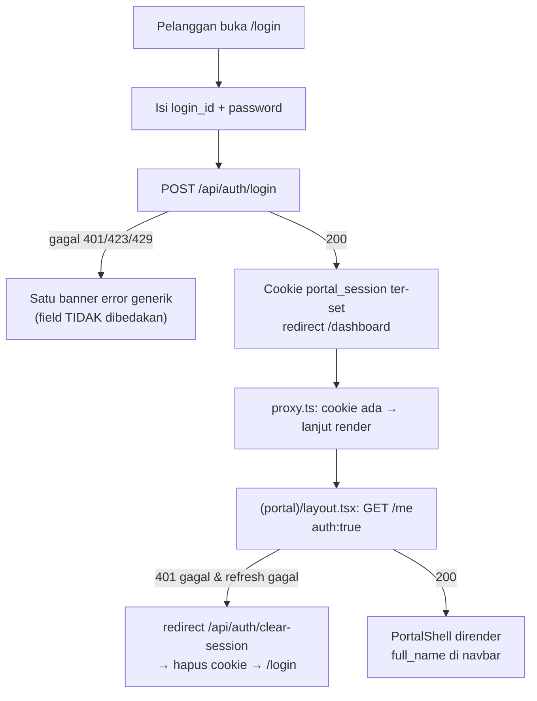
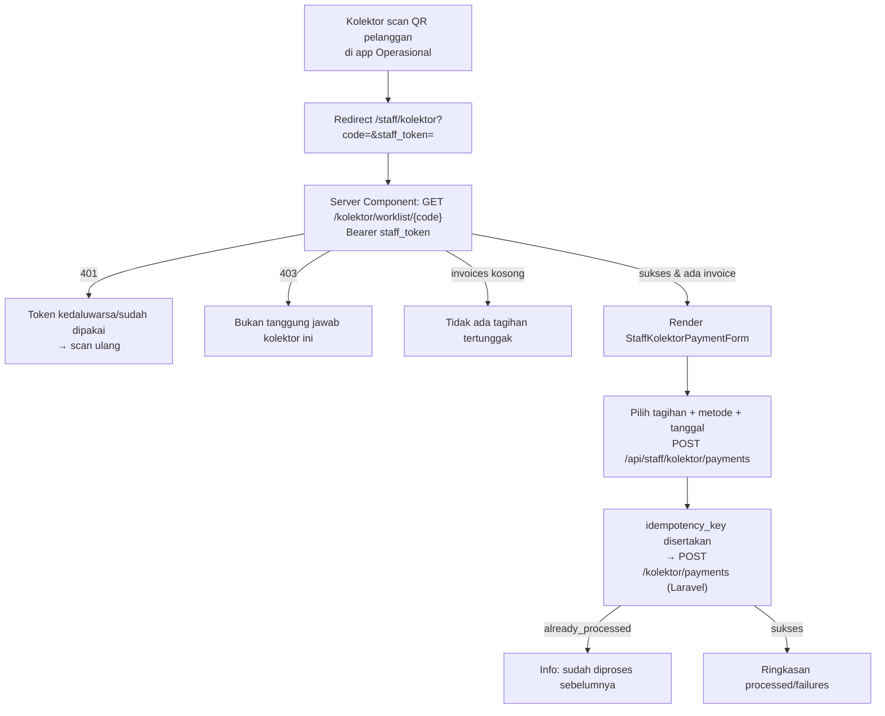
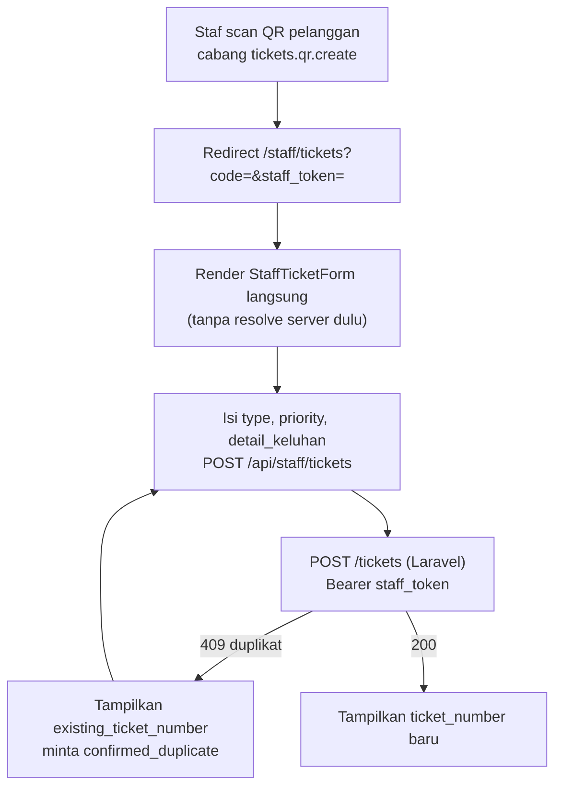
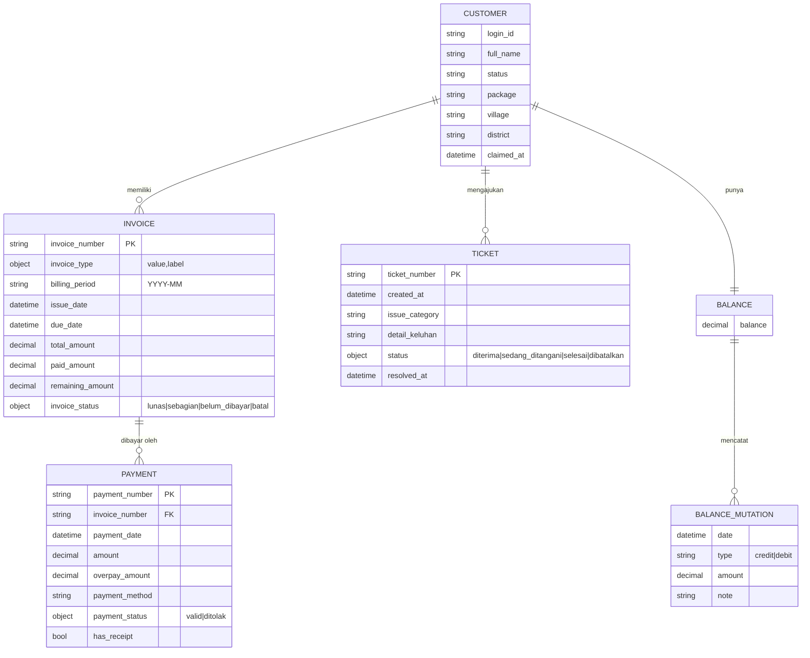

# Dokumentasi Proyek — Portal Pelanggan (Next.js)

> Ditulis 2026-08-31 dari kode yang benar-benar berjalan di repo ini (bukan
> rancangan). Lihat juga `frontend-nextjs-rancangan.md` (blueprint awal,
> sebagian sudah berkembang lebih jauh — dokumen ini adalah potret kondisi
> saat ini) dan `docs/api/postman/` (koleksi API).

## Daftar Isi

1. [Ringkasan](#1-ringkasan)
2. [Arsitektur — Pola BFF](#2-arsitektur--pola-bff)
3. [Business Logic per Domain](#3-business-logic-per-domain)
4. [User Flow](#4-user-flow)
5. [Auth & Siklus Sesi](#5-auth--siklus-sesi)
6. [Peta Route ↔ Endpoint Laravel](#6-peta-route--endpoint-laravel)
7. [Model Data / "Skema"](#7-model-data--skema)
8. [Struktur Folder & Komponen](#8-struktur-folder--komponen)
9. [Konvensi Wajib & Larangan](#9-konvensi-wajib--larangan)
10. [Environment & Deployment](#10-environment--deployment)
11. [Spesifikasi Tiap Halaman](#11-spesifikasi-tiap-halaman)
12. [Tabel Kode Error & Status HTTP](#12-tabel-kode-error--status-http)
13. [Detail Komponen](#13-detail-komponen)

---

## 1. Ringkasan

**Portal Pelanggan** adalah aplikasi Next.js (App Router) yang jadi kanal
web untuk pelanggan Whusnet (ISP) melihat tagihan, pembayaran, saldo, dan
tiket keluhan mereka sendiri — **tanpa database sendiri**. Semua data dan
business logic hidup di **Laravel API** (`whusnet-operasional`, repo
terpisah), diakses lewat endpoint `/api/customer-portal/*`.

Selain pelanggan, repo ini juga melayani dua peran **staf lapangan** lewat
scan QR fisik (bukan login manual): **kolektor** (mencatat pembayaran
tunai/transfer di lokasi) dan **staf pembuat tiket** (membuat tiket
keluhan/pemasangan atas nama pelanggan yang di-scan).

| Peran | Cara masuk | Halaman |
|---|---|---|
| Pelanggan | Aktivasi (`login_id`+PIN dari kartu QR) lalu login password | `/login`, `/aktivasi`, `/dashboard`, `/tagihan`, `/pembayaran`, `/saldo`, `/tiket`, `/profil` |
| Tamu scan QR | Scan QR kartu pelanggan → redirect otomatis | `/klaim?code=` |
| Staf kolektor | Scan QR dari app Operasional, token one-shot di URL | `/staff/kolektor?code=&staff_token=` |
| Staf tiket | Scan QR dari app Operasional, token one-shot di URL | `/staff/tickets?code=&staff_token=` |

## 2. Arsitektur — Pola BFF

Next.js berperan sebagai **Backend-for-Frontend**: browser TIDAK PERNAH
bicara langsung ke Laravel. Semua panggilan API lewat Route Handler
(`app/api/**/route.ts`) atau langsung dari Server Component (yang jalan di
server, bukan browser).



**Kenapa begini:**
- `access_token`/`refresh_token` disimpan cookie `httpOnly` (`portal_session`,
  di-encode `iron-session`) — tidak pernah tersentuh JS browser, jadi celah
  XSS tidak otomatis bisa mencuri token.
- Server Component boleh panggil `callLaravel()` langsung (menghindari hop
  ekstra ke Route Handler sendiri) — dipakai di `(portal)/layout.tsx`,
  `dashboard`, `tagihan`, dst. Konsekuensinya: Server Component **tidak
  boleh menulis cookie** (batasan Next.js), jadi refresh-token-di-tengah-
  render yang gagal ditulis dibiarkan diam (lihat `session.ts`
  `isCookieWriteRestrictedError`) — token lama tetap dipakai sampai ada
  request lewat Route Handler yang sah menulis ulang.
- `PORTAL_CLIENT_SECRET` (identitas aplikasi Portal ke Laravel, header
  `X-Portal-Client`) hanya pernah dibaca di server — **tidak boleh**
  diprefix `NEXT_PUBLIC_`.

## 3. Business Logic per Domain

### 3.1 Auth (pelanggan)
- **Klaim/Aktivasi** (`POST /auth/claim`): pelanggan baru menukar
  `login_id` + `pin` (6 digit, dari kartu QR fisik yang dicetak staf) +
  `new_password` menjadi akun aktif. Login ID **terkunci** (tidak bisa
  diedit) kalau datang dari `/klaim?code=` (hasil resolve QR).
- **Login** (`POST /auth/login`): `login_id` + `password` → sepasang token.
- **Token**: `access_token` (umur pendek, 900 detik/15 menit) +
  `refresh_token` (rotasi — dipakai sekali, dapat pasangan baru dari
  `POST /auth/refresh`, refresh_token lama otomatis mati; reuse token lama
  = ditolak, sesi dianggap dicuri).
- **Logout / Logout semua perangkat**: `POST /auth/logout` vs
  `POST /auth/logout-all` — efeknya **sama persis** saat ini (keduanya
  mencabut semua token pelanggan itu), didokumentasikan begitu apa adanya.
- **Ganti password** (`PUT /me/password`): efek samping penting — semua
  sesi/token LAIN dicabut, sesi yang memanggil endpoint ini sendiri tetap
  hidup. UI wajib memberi tahu ini secara eksplisit di `/profil`.

### 3.2 Tagihan (Invoice)
- Status: `lunas` (hijau) / `sebagian` (kuning) / `belum_dibayar` (merah) /
  `batal` (abu). Selalu dikirim sebagai objek `{value, label}` — label
  Indonesia dari backend, **tidak pernah** ditulis ulang di frontend.
- List bisa difilter `status` + `period` (`YYYY-MM`), dipaginasi 10/halaman.
- Detail tagihan menyertakan array `payments` yang sudah menempel ke
  tagihan itu.
- Uang selalu string desimal (`"150000.00"`) dari backend — **tidak pernah**
  disimpan sebagai `number`/`float` di state, diparse hanya saat format
  tampilan (hindari floating-point error).

### 3.3 Pembayaran (Payment)
- Status: `valid` (hijau) / `ditolak` (abu — **bukan** merah, karena
  `label`-nya sudah "belum terverifikasi — hubungi admin", bukan "Gagal").
- `has_receipt: false` → tombol "Lihat Kwitansi" **disembunyikan**, bukan
  cuma disabled.
- Kwitansi (`GET /me/payments/{nomor}/receipt`) dirender di layout
  **terpisah** (`(print)`), print-friendly. Field yang sengaja tidak pernah
  ada dari backend: `penerima`, `penagih`, `catatan` — jangan render slot
  untuk field ini.

### 3.4 Saldo (Balance)
- `GET /me/balance` mengirim `balance` (angka tunggal, string desimal) +
  `mutations` (array dipaginasi 10/halaman). Tipe mutasi `credit` ("Masuk",
  hijau) / `debit` ("Keluar", merah).

### 3.5 Tiket (Ticket) — sisi pelanggan (read-only)
- Pelanggan **hanya bisa melihat** riwayat tiket (`GET /me/tickets`,
  **tanpa filter/param sama sekali** — beda dari tagihan/pembayaran).
  Pelanggan **tidak bisa** membuat tiket sendiri dari Portal — itu tugas
  staf (lihat 3.6).
- Field yang sengaja tidak pernah dikirim: riwayat/log mentah,
  `catatan_teknis`, nama staf penangan, ID task internal.

### 3.6 Staf Kolektor — pencatatan pembayaran lapangan
- Alur: kolektor scan QR kartu pelanggan dari app Operasional →
  di-redirect ke `/staff/kolektor?code=&staff_token=` (token **one-shot**,
  bukan sesi — dikirim manual lewat header `Authorization: Bearer` di tiap
  panggilan, **tidak pernah** disimpan `iron-session`/cookie).
- Server Component resolve worklist dulu (`GET /kolektor/worklist/{code}`)
  **sebelum** merender form — kalau token salah/kedaluwarsa/pelanggan di
  luar wilayah tanggung jawab kolektor (403), tampilkan pesan error di
  situ, jangan render form kosong yang gagal saat submit.
  Kalau tidak ada tagihan tertunggak, tampilkan pesan itu, bukan form kosong.
- Submit (`POST /kolektor/payments` via `app/api/staff/kolektor/payments`)
  memakai `idempotency_key` — retry aman, `already_processed: true` bukan
  kegagalan.

### 3.7 Staf Tiket — pembuatan tiket lapangan
- Alur: staf scan QR → `/staff/tickets?code=&staff_token=`. Beda dari
  kolektor, halaman ini **tidak resolve apa pun di server** — identitas
  pelanggan sudah dipegang penuh oleh `staff_token` di sisi Laravel; `code`
  cuma penanda "masih di halaman yang benar".
- Tipe tiket: `MTN` (maintenance) / `C-REQ` (customer request). Prioritas:
  `low` / `Medium` / `High` / `Urgent`.
- **409 duplikat**: pelanggan itu masih punya tiket terbuka. Body 409 bawa
  `existing_ticket_number` — UI harus minta konfirmasi eksplisit
  (`confirmed_duplicate: true`) sebelum submit ulang, bukan otomatis retry.

### 3.8 Resolve QR (`GET /qr/resolve?code=`)
- Dipanggil dari `/klaim` untuk menerjemahkan kode QR fisik jadi
  `login_id` + `account_status` (`pending_claim` / `active` / `null`).
- **Anti-enumeration**: semua kegagalan (token tidak ketemu, signature
  salah, dicabut, POP mismatch) dijawab 404 generik yang sama — Next.js
  tidak boleh membedakan pesannya.

## 4. User Flow

### 4.1 Aktivasi akun via scan QR (pelanggan baru)



### 4.2 Login & akses halaman berauth



### 4.3 Refresh token otomatis (di tengah request apa pun ke `/me/*`)

```mermaid
flowchart TD
    A["callLaravel(path, auth:true)"] --> B["Kirim Bearer access_token"]
    B -->|200| Z["Kembalikan data"]
    B -->|401 expired| C["tryRefresh(): POST /auth/refresh\ndengan refresh_token"]
    C -->|sukses| D["Simpan pasangan token baru\nulangi request ASLI sekali"]
    D --> Z
    C -->|gagal (reuse/expired)| E["clearSession()\nreturn 401 'Sesi tidak valid'"]
    E --> F["Caller (halaman) redirect /login"]
```

### 4.4 Staf kolektor mencatat pembayaran



### 4.5 Staf membuat tiket



## 5. Auth & Siklus Sesi

| Aspek | Pelanggan | Staf (kolektor/tiket) |
|---|---|---|
| Media | Cookie `portal_session` (`iron-session`, httpOnly) | Query string `staff_token`, one-shot |
| Disimpan di Next.js? | Ya (`lib/session.ts`) | Tidak — dipegang komponen client sekali, dikirim manual per request |
| Middleware (`proxy.ts`) | Cek cookie ada/tidak, redirect `/login` jika tidak ada | Dilewatkan (`/staff/*` di-skip gerbang cookie) |
| Refresh otomatis | Ya (`callLaravel` refresh-on-401) | Tidak — token expired = scan ulang QR |

`proxy.ts` (dulu `middleware.ts`, berganti nama di Next.js 16) **hanya**
mengecek keberadaan cookie — murah, jalan di Edge. Validasi "apakah
token-nya masih sah" tetap tanggung jawab `laravel-client.ts` saat
Server Component/Route Handler benar-benar memanggil Laravel.

## 6. Peta Route ↔ Endpoint Laravel

| Route Handler Next.js | Method | Endpoint Laravel | Auth |
|---|---|---|---|
| `/api/auth/login` | POST | `/auth/login` | – |
| `/api/auth/claim` | POST | `/auth/claim` | – |
| `/api/auth/logout` | POST | `/auth/logout` | cookie |
| `/api/auth/logout-all` | POST | `/auth/logout-all` | cookie |
| `/api/auth/clear-session` | GET | – (hanya hapus cookie lokal + redirect) | cookie |
| `/api/me` | GET | `/me` | cookie |
| `/api/me/password` | PUT | `/me/password` | cookie |
| `/api/me/invoices` | GET | `/me/invoices` | cookie |
| `/api/me/invoices/[invoiceNumber]` | GET | `/me/invoices/{no}` | cookie |
| `/api/me/payments` | GET | `/me/payments` | cookie |
| `/api/me/payments/[paymentNumber]/receipt` | GET | `/me/payments/{no}/receipt` | cookie |
| `/api/me/balance` | GET | `/me/balance` | cookie |
| `/api/me/tickets` | GET | `/me/tickets` | cookie |
| `/api/me/tickets/[ticketNumber]` | GET | `/me/tickets/{no}` | cookie |
| `/api/staff/tickets` | POST | `/tickets` | Bearer `staff_token` manual |
| `/api/staff/kolektor/payments` | POST | `/kolektor/payments` | Bearer `staff_token` manual |

Dipanggil **langsung** dari Server Component (tanpa Route Handler sendiri):
`GET /me` (`(portal)/layout.tsx` + tiap halaman data), `GET /qr/resolve`
(`/klaim`), `GET /kolektor/worklist/{code}` (`/staff/kolektor`).

`POST /auth/refresh` tidak pernah diekspos sebagai Route Handler publik —
murni dipanggil internal oleh `laravel-client.ts`.

## 7. Model Data / "Skema"

**Repo ini sengaja tidak punya database sendiri.** Satu-satunya sumber
kebenaran data (skema tabel MySQL sesungguhnya) ada di repo
`whusnet-operasional` (Laravel). Yang didokumentasikan di sini adalah
**kontrak data** yang dilihat Next.js — persis `src/lib/types/portal-api.ts`
— karena itulah "skema" yang relevan buat sisi frontend.



**Aturan bentuk data — wajib diikuti saat menambah tipe baru:**
- **Uang** selalu string desimal (`"150000.00"`), tidak pernah `number`.
- **Status** selalu objek `{value, label}` — render `label`, logic pakai
  `value`, tidak pernah hardcode teks Indonesia di komponen.
- **Envelope beda per jenis endpoint**: `/me/*` (data resource) →
  `{data, meta}`; `/auth/*` dan `PUT /me/password` → objek flat langsung.
- **404 dipakai untuk "tidak ada" DAN "milik orang lain"** — sengaja
  disamakan (anti-enumeration), UI tidak boleh membedakan pesannya.
- Field yang sengaja tidak pernah dikirim backend (lihat komentar per
  interface di `portal-api.ts`) tidak boleh diasumsikan ada.

Detail penuh kontrak endpoint (request/response persis, kode status, pesan
error) ada di `business-logic.md` pada repo `whusnet-operasional`
(`docs/api/api-portal-pelanggan/business-logic.md`) — sumber kebenaran,
`portal-api.ts` di repo ini adalah turunannya.

## 8. Struktur Folder & Komponen

```
src/
  app/
    (auth)/          layout tanpa nav — login, aktivasi, klaim (resolve QR)
    (portal)/         layout berauth — sidebar desktop + bottom nav mobile
    (print)/          layout terpisah, print-friendly — kwitansi
    (staff)/staff/    layout tanpa nav, khusus token one-shot QR staf
    api/              Route Handler — proxy tipis ke Laravel
  components/         komponen shared (StatusBadge, MoneyDisplay, DateDisplay,
                       Pagination, EmptyState, ErrorBanner, SkeletonRows, dst)
  lib/
    laravel-client.ts   satu-satunya pintu fetch ke Laravel (auth, refresh-on-401)
    session.ts          baca/tulis/hapus cookie sesi (iron-session)
    types/portal-api.ts kontrak tipe — turunan business-logic.md Laravel
  proxy.ts            gerbang cookie sebelum render (dulu middleware.ts)
```

Komponen reusable penting:
- `<StatusBadge value label />` — satu pemetaan warna untuk status
  invoice/payment/ticket, dari `{value, label}` API apa adanya.
- `<Pagination meta onPageChange />` — baca `meta` paginasi Laravel Resource
  apa adanya, tidak menghitung ulang total halaman.
- `<MoneyDisplay value />` / `<DateDisplay value format="long|short" />` —
  format on-render dari string mentah, tidak menyimpan hasil parse sebagai
  state.
- `<EmptyState>`, `<ErrorBanner onRetry>`, `<SkeletonRows count>` — pola
  loading/empty/error konsisten di semua halaman list.

## 9. Konvensi Wajib & Larangan

Ringkas dari `frontend-nextjs-rancangan.md` (masih berlaku penuh):

1. **Tidak boleh** ada database/ORM sisi Next.js — semua data dari Laravel.
2. Env rahasia (`PORTAL_CLIENT_SECRET`, `SESSION_COOKIE_SECRET`)
   **tidak boleh** diprefix `NEXT_PUBLIC_`.
3. Token **tidak boleh** disimpan `localStorage` atau cookie non-`httpOnly`.
4. Client Component **tidak boleh** `fetch()` langsung ke `LARAVEL_API_URL`
   — selalu lewat Route Handler sendiri.
5. Semua panggilan ke Laravel lewat `lib/laravel-client.ts` — tidak
   `fetch()` manual tersebar di banyak file.
6. Label status Indonesia tidak di-hardcode ulang — pakai `label` dari API.
7. 404 "tidak ada" vs "milik pelanggan lain" tidak dibedakan tampilannya.
8. Nominal uang tidak disimpan sebagai `number`/`float` di state.
9. Tidak membuat UI untuk fitur yang endpoint-nya belum ada (buat tiket
   dari Portal, upload bukti bayar, gateway pembayaran/QRIS, dll — lihat
   daftar lengkap di `frontend-nextjs-rancangan.md` §"Yang SENGAJA belum
   ada endpoint-nya").
10. Tidak ada rute publik "lihat tagihan tanpa akun" di Portal ini — itu
    tanggung jawab app QR gerbang publik yang terpisah.

## 10. Environment & Deployment

```
LARAVEL_API_URL=http://laravel-app:8000/api/customer-portal   # internal, satu infra
PORTAL_CLIENT_SECRET=<sama dengan PORTAL_CLIENT_SECRET Laravel>
SESSION_COOKIE_SECRET=<untuk encode/sign cookie sesi, generate sendiri, ≥32 karakter>
```

Semua tiga variabel di atas **hanya** dibaca dari Route Handler/Server
Component (server-side) — tidak pernah dari Client Component.

- Deploy Next.js dan Laravel di **satu jaringan Docker/VPC/region** (target
  latency internal <5ms) — `docker-compose.yaml` di repo ini sudah
  menyediakan struktur untuk itu.
- `Dockerfile` + `docker-compose.yaml` ada di root repo untuk containerize
  app ini.
- CORS Laravel (`PORTAL_ALLOWED_ORIGIN`) tetap diisi untuk jaga-jaga, tapi
  jalur utama Portal (Route Handler → server-to-server) tidak lewat CORS.

## 11. Spesifikasi Tiap Halaman

Kolom "Sumber data" mendaftar endpoint yang dipanggil, langsung dari Server
Component (bukan lewat Route Handler sendiri, kecuali disebut lain).

### `/login` — `(auth)/login/page.tsx`
- **Sumber data**: tidak ada (form murni) + baca query `?session_expired=1`.
- **Tampilan**: card tunggal, field `login_id` + `password`, tombol submit,
  link ke `/aktivasi`.
- **State khusus**: kalau datang dari redirect sesi kedaluwarsa
  (`/api/auth/clear-session`), tampil banner kuning "Sesi Anda berakhir.
  Silakan masuk kembali." di atas form (bukan banner error merah biasa).
- **Error**: satu banner merah generik untuk 401/423/429 — pesan field
  tidak dibedakan (`LoginForm`).
- **Guard ganda submit**: `submittingRef` (bukan cuma `state loading`) —
  cegah dua request terkirim kalau tombol/Enter dipencet dobel dalam tick
  sinkron yang sama, sebelum `setState` sempat ter-flush.

### `/aktivasi` — `(auth)/aktivasi/page.tsx`
- **Sumber data**: tidak ada; render `<ClaimForm />` dengan `login_id`
  kosong & bisa diedit bebas (beda dari `/klaim`, lihat di bawah).
- Lihat detail form di §13 `ClaimForm`.

### `/klaim?code=` — `(auth)/klaim/page.tsx`
- **Sumber data**: `GET /qr/resolve?code=` (Server Component, langsung).
- **3 cabang render** berdasar hasil resolve:
  1. `code` tidak ada di URL → pesan "Kode QR tidak ditemukan di URL."
  2. Resolve gagal (404, anti-enumeration) → "Kode QR tidak valid atau
     sudah kedaluwarsa." + tombol ke `/login`.
  3. `account_status === 'active'` → "Akun Sudah Aktif" + tombol ke `/login`.
  4. `account_status` `pending_claim`/`null` → render `<ClaimForm
     initialLoginId lockLoginId />` (Login ID sudah terisi & readonly).
- Ada `loading.tsx` khusus untuk Suspense boundary halaman ini.

### `/dashboard` — `(portal)/dashboard/page.tsx`
- **Sumber data**: 3 panggilan **paralel** (`Promise.all`) —
  `GET /me`, `GET /me/invoices?status=belum_dibayar`, `GET /me/balance`.
- **Tampilan**: 3 kartu ringkasan (Profil, Tagihan Terdekat, Saldo) + grid
  4 shortcut (Tagihan/Pembayaran/Saldo Mutasi/Bantuan Tiket).
- **Logic tagihan terdekat**: hasil `/me/invoices` di-sort ulang di
  client berdasar `due_date` menaik (endpoint tidak menjamin urutan by
  jatuh tempo) — item pertama array hasil sort itulah yang ditampilkan,
  bukan item pertama respons mentah.
- Kartu "Semua Lunas" (ikon centang hijau) ditampilkan kalau tidak ada
  tagihan `belum_dibayar` sama sekali.
- **Error**: kalau salah satu dari 3 panggilan gagal → `<ErrorBanner />`
  untuk seluruh halaman (bukan partial — ketiganya dianggap satu kesatuan
  ringkasan).

### `/tagihan` (list) — `(portal)/tagihan/page.tsx`
- **Sumber data**: `GET /me/invoices?status=&period=&page=` — filter dibaca
  dari `searchParams`, diteruskan sebagai query string apa adanya.
- **Filter**: `<form method="GET">` native (bukan client-side state) —
  submit filter = navigasi ulang halaman dengan query baru. Dropdown status
  (5 opsi termasuk "Semua"), `<input type="month">` untuk periode.
- **Tampilan**: tabel di desktop (`md:` ke atas), kartu bertumpuk di mobile
  — kolom identik: No. Tagihan, Periode, Jatuh Tempo, Total, Sisa, Status.
- **State**: `EmptyState` (ikon `Receipt`) kalau kosong, `ErrorBanner` kalau
  gagal fetch, `<Pagination>` di bawah tabel/list.

### `/tagihan/[invoiceNumber]` (detail) — `tagihan/[invoiceNumber]/page.tsx`
- **Sumber data**: `GET /me/invoices/{nomor}` — includes `payments[]`.
- **Tampilan**: link "Kembali", header (nomor + badge status), 3 kartu
  angka besar berdampingan (Total/Sudah Dibayar/Sisa — Sisa dengan aksen
  border merah), detail meta (periode, jatuh tempo, tipe layanan), lalu
  tabel/list riwayat pembayaran yang menempel ke tagihan ini.
- **404**: `EmptyState` "Tagihan tidak ditemukan atau bukan milik Anda." —
  pesan generik, tidak membedakan sebab (anti-enumeration).
- Pembayaran kosong → `EmptyState` terpisah (ikon `CreditCard`) di dalam
  section riwayat, bukan menyembunyikan section-nya.

### `/pembayaran` (list) — `(portal)/pembayaran/page.tsx`
- **Sumber data**: `GET /me/payments?status=&period=&page=`.
- **Filter**: sama pola `/tagihan`, tapi opsi status cuma 2 + "Semua":
  `valid`, `ditolak` (label tampil "Belum Terverifikasi", bukan "Ditolak").
- **Kolom tambahan** vs tagihan: Metode, Lebih Bayar (`overpay_amount`,
  ditampilkan `-` kalau `0`, dihitung lewat helper `hasOverpay()` parse
  `Number.parseFloat`), Aksi.
- **Tombol "Kwitansi"**: render kondisional `p.has_receipt && (...)` —
  betul-betul tidak dirender (bukan disabled) kalau `false`.

### `/pembayaran/[paymentNumber]/kwitansi` — `(print)/.../kwitansi/page.tsx`
- **Sumber data**: `GET /me/payments/{nomor}/receipt`.
- **Layout terpisah** (`(print)` route group) — tanpa sidebar/navbar Portal,
  card putih ringkas mirip struk: kop nama usaha, blok info pelanggan
  (nama, CID, HP, alamat per baris), blok detail pembayaran (nomor,
  tanggal, metode, status, keterangan cicilan bila ada), blok ringkasan
  invoice terkait (kalau `invoice.ada`), jumlah dibayar besar + lebih
  bayar bila ada, tombol Cetak (`<PrintButton />`, `window.print()`,
  disembunyikan via `print:hidden`).
- Field yang `PaymentReceipt` **tidak pernah** kirim, sengaja: `penerima`,
  `penagih`, `catatan` — dicatat eksplisit di komentar kode halaman ini.
- **404**: `EmptyState` "Kwitansi tidak ditemukan."

### `/saldo` — `(portal)/saldo/page.tsx`
- **Sumber data**: `GET /me/balance?page=` — `balance` (angka tunggal) +
  `mutations[]` dipaginasi (dibawa dalam `meta` yang sama, lihat
  `BalanceEnvelope` §7).
- **Tampilan**: hero saldo besar di tengah, lalu list mutasi — tiap baris
  border kiri berwarna (hijau `credit`/merah `debit`), ikon panah arah
  (`ArrowDownLeft` masuk / `ArrowUpRight` keluar), badge `type_label`,
  tanggal, `note` (kalau ada), nominal bertanda `+`/`-`.
- **State**: `EmptyState` (ikon `Wallet`) kalau `mutations` kosong,
  `Pagination` kalau ada isi.

### `/tiket` (list) — `(portal)/tiket/page.tsx`
- **Sumber data**: `GET /me/tickets?page=` — **tanpa filter status/period**
  sama sekali (beda dari tagihan/pembayaran, endpoint memang tidak
  menyediakan itu).
- **Tampilan**: list kartu (bukan tabel, di semua ukuran layar) — nomor
  tiket, badge status, kategori keluhan (ikon `MessageSquare`), tanggal
  dibuat, panah navigasi ke detail.

### `/tiket/[ticketNumber]` (detail) — `tiket/[ticketNumber]/page.tsx`
- **Sumber data**: `GET /me/tickets/{nomor}`.
- **Tampilan**: header (nomor + badge status), kategori kendala, blok teks
  `detail_keluhan` (background muted, `whitespace-pre-wrap`), grid 2 kolom
  metadata — "Dibuat Pada" selalu tampil, "Selesai Ditangani"
  (`resolved_at`) **hanya** dirender kalau nilainya bukan `null`.
- **404**: `EmptyState` "Tiket bantuan tidak ditemukan."

### `/profil` — `(portal)/profil/page.tsx`
- **Sumber data**: `GET /me`.
- **Tampilan**: dua kartu — (1) info read-only via `<dl>` (Login ID, Nama,
  Status/badge, Paket, Desa, Kecamatan, Tanggal Aktivasi Portal); (2) form
  ganti password (`<ChangePasswordForm />`, lihat §13).
- Tidak ada tombol "edit profil" — semua field di kartu (1) memang
  read-only (data pelanggan dikelola dari sisi Laravel/staf, bukan Portal).

### `/staff/kolektor?code=&staff_token=` — `(staff)/staff/kolektor/page.tsx`
- **Sumber data**: `GET /kolektor/worklist/{code}` dengan header
  `Authorization: Bearer <staff_token>` manual (bukan `auth: true`).
- **4 cabang render**: param URL tidak lengkap → "Tautan Tidak Lengkap";
  401 → token kedaluwarsa/terpakai; 403 → "bukan tanggung jawab Anda";
  invoice kosong → "Tidak ada tagihan tertunggak"; sukses & ada invoice →
  `<StaffKolektorPaymentForm />` (§13).
- Ada `loading.tsx` khusus.

### `/staff/tickets?code=&staff_token=` — `(staff)/staff/tickets/page.tsx`
- **Sumber data**: tidak ada resolve server — render langsung
  `<StaffTicketForm staffToken />` (§13). `code` hanya penanda posisi,
  identitas pelanggan sudah dipegang penuh oleh `staff_token` di Laravel.
- Param tidak lengkap → pesan "Tautan Tidak Lengkap" yang sama polanya
  dengan halaman kolektor.

## 12. Tabel Kode Error & Status HTTP

Status berikut adalah kondisi **normal** yang harus ditampilkan pesannya ke
pengguna — bukan exception (lihat filosofi `ApiResult` union di §2).

| Status | Konteks endpoint | Arti | Perlakuan UI |
|---|---|---|---|
| `401` | `/auth/login` | `login_id`/password salah | Banner generik, field TIDAK dibedakan mana yang salah |
| `401` | `/auth/claim` | `login_id`/PIN salah | Banner generik, sama pola login |
| `401` | `/me/*` (setelah refresh gagal) | Sesi habis/dicabut/reuse token terdeteksi | `clearSession()` → redirect `/login?session_expired=1` |
| `401` | `staff_token` (kolektor/tiket) | Token one-shot kedaluwarsa/sudah terpakai | "Token sudah kedaluwarsa atau sudah dipakai — scan ulang QR" |
| `403` | `GET /kolektor/worklist/{code}` | Pelanggan di luar wilayah kolektor ini | "Pelanggan ini bukan tanggung jawab Anda." |
| `404` | `/qr/resolve`, `/me/invoices/{no}`, `/me/tickets/{no}`, `/me/payments/{no}/receipt` | Data tidak ada **atau** milik pelanggan lain (disamakan sengaja, anti-enumeration) | Pesan generik "...tidak ditemukan" — **tidak** membedakan sebab |
| `409` | `/auth/claim` | Akun ini sudah pernah diaktivasi | Banner kuning + tombol "Ke Halaman Masuk" (bukan retry form) |
| `409` | `POST /tickets` (staf) | Pelanggan masih punya tiket terbuka | Tampilkan `existing_ticket_number` + tombol "Tetap Buat Tiket Baru" (`confirmed_duplicate: true`) |
| `422` | `/auth/claim`, `PUT /me/password` | Validasi field gagal (mis. `new_password` terlalu pendek) | List error per-field dari `errors.new_password` |
| `422` | Route Handler lokal (login/password kosong) | Body request tidak lengkap sebelum sempat sampai Laravel | Pesan generik field wajib |
| `423` | `/auth/claim` | PIN terkunci sementara (percobaan salah berkali-kali) | "PIN terkunci sementara, coba lagi nanti" — **tanpa** hitung mundur presisi (backend tidak kirim `retry_after` di endpoint ini) |
| `429` | `/auth/login` (rate limit) | Terlalu banyak percobaan login | Banner generik (sama jalur pesan dengan 401) |
| Network/Laravel down | Semua endpoint | `fetch()` gagal total (bukan respons HTTP valid) | `catch` di form → "Tidak bisa terhubung ke server, coba lagi." — beda dari `ErrorBanner` yang dipakai Server Component |
| Gagal generik Server Component | `/me/*` saat render halaman | `!result.ok` tanpa status spesial di atas | `<ErrorBanner />` — banner + tombol retry, bukan halaman putih kosong |

## 13. Detail Komponen

Semua form adalah **Client Component** (`'use client'`), memakai pola guard
submit yang sama: `submittingRef = useRef(false)` dicek di awal handler
(bukan hanya `state loading`) — mencegah request dobel dari klik/Enter
beruntun dalam tick sinkron yang sama, sebelum `setState` sempat di-flush.

### `<LoginForm sessionExpired? />`
- **Props**: `sessionExpired?: boolean` — kontrol banner kuning "Sesi Anda
  berakhir" di atas form (dari `/login?session_expired=1`).
- **State**: `loginId`, `password`, `loading`, `error`.
- **Submit**: `POST /api/auth/login` → sukses: `router.push('/dashboard')`
  + `router.refresh()`. Gagal: `error` diisi dari `body.message` apa
  adanya (tidak diterjemahkan ulang).

### `<ClaimForm initialLoginId? lockLoginId? />`
- **Props**: `initialLoginId?: string` (default kosong), `lockLoginId?:
  boolean` (default `false` — dari `/aktivasi` manual; `true` dari
  `/klaim?code=` hasil resolve QR, input jadi `readOnly`).
- **State tambahan** vs LoginForm: `pin`, `confirmPassword`,
  `errorKind: 'generic' | 'already-claimed' | null`, `fieldErrors: string[]`.
- **Validasi client**: `newPassword !== confirmPassword` diblokir sebelum
  submit (backend hanya terima `new_password` tunggal). Input PIN
  di-`replace(/\D/g, '')` + `slice(0, 6)` saat mengetik — hanya angka,
  maksimal 6 digit, style monospace berjarak lebar gaya OTP.
- **Cabang render khusus**: `errorKind === 'already-claimed'` mengganti
  seluruh form dengan pesan 409 + tombol ke `/login` (tidak menawarkan
  retry form yang sama).

### `<ChangePasswordForm />`
- **Tanpa props** — dipakai di `/profil`, submit ke `PUT /api/me/password`.
- **State**: `currentPassword`, `newPassword`, `confirmPassword`, `success`
  (boolean, bukan redirect — form tetap di halaman yang sama).
- Sukses → banner hijau eksplisit: **"Password berhasil diganti. Sesi Anda
  di perangkat lain otomatis keluar."** — field form dikosongkan
  (`setCurrentPassword('')` dst), tapi halaman tidak redirect (sesi yang
  memanggil ini sendiri tetap hidup, sesuai efek `PUT /me/password`).

### `<StaffTicketForm staffToken />`
- **Props**: `staffToken: string` (wajib, dari query URL).
- **State**: `type` (`MTN`/`C-REQ`, default `MTN`), `priority` (default
  `Medium`), `detailKeluhan` (textarea, `maxLength={2000}`),
  `duplicateTicketNumber`, `success`.
- **Alur 409**: `submit(confirmedDuplicate)` dipanggil dua cara — submit
  form normal (`confirmedDuplicate=false`) dan tombol "Tetap Buat Tiket
  Baru" (`confirmedDuplicate=true`) setelah 409 muncul. Token **tidak**
  diminta ulang di antara kedua percobaan — one-shot baru terkonsumsi
  setelah tiket benar-benar tersimpan.
- Sukses → tampilan final "Tiket Dibuat" + `ticket_number`, pesan bahwa
  halaman boleh ditutup (token sudah terpakai, tidak bisa submit ulang).

### `<StaffKolektorPaymentForm staffToken customerLabel invoices />`
- **Props**: `staffToken: string`, `customerLabel: string` (nama + kode
  pelanggan sudah digabung dari Server Component), `invoices:
  StaffKolektorWorklistInvoice[]` (worklist hasil resolve, sudah tersaring
  ke tanggung jawab kolektor ini).
- **`idempotencyKey`**: `crypto.randomUUID()`, digenerate **sekali per
  render** (`useState(() => ...)`, bukan per-submit) — retry akibat
  double-tap dijawab backend sebagai "sudah pernah diproses"
  (`already_processed: true`), bukan payment tercatat dobel.
- **State per baris invoice**: `selected` (checkbox per `invoice.id`),
  `amounts` (default terisi `remaining_amount` masing-masing, tapi tetap
  input manual — kolektor pegang uang fisiknya, nominal tidak otomatis
  dikunci ke sisa tagihan).
- **`method`**: `cash`/`transfer`/`qris`/`lainnya`, satu metode berlaku
  untuk semua baris yang dicentang dalam satu submit.
- **`collectedDate`**: `new Date().toISOString().slice(0, 10)` — tanggal
  hari ini, di-generate sekali saat render (bukan berubah dinamis kalau
  form dibiarkan terbuka lewat tengah malam).
- Submit diblokir (`disabled`) kalau tidak ada baris yang dicentang
  (`anySelected`). Respons `success: false` (walau HTTP 200) tetap
  dianggap gagal — dibaca dari `body.failures[].reason` per baris.

### `<StatusBadge value label />`
- **Props**: `value: string`, `label: string` — langsung dari objek
  `{value, label}` API, tidak pernah dari string hardcode.
- **Pemetaan warna** (lihat kode `COLOR_BY_VALUE`/`DOT_COLOR_BY_VALUE`):
  tabel lengkap sudah ada di §konvensi (frontend-nextjs-rancangan.md) —
  nilai yang tidak dikenal jatuh ke `DEFAULT_COLOR` (abu netral), bukan
  error, supaya status baru dari backend tidak merusak tampilan.
- **Urgent pulse**: hanya `belum_dibayar` yang boleh berdenyut (dot
  animasi) — sinyal prioritas tunggal, menghormati
  `prefers-reduced-motion` lewat CSS global.

### Komponen presentasi kecil lain
- `<MoneyDisplay value />` — format `value` (string desimal) ke
  `Rp 150.000` (`Intl.NumberFormat('id-ID', {style:'currency',
  currency:'IDR', maximumFractionDigits:0})`) saat render, tidak menyimpan
  hasil parse.
- `<DateDisplay value format="long"|"short" className? />` — format
  ISO-8601 ke lokal Indonesia, dua varian panjang (`20 Agustus 2026`)
  dan pendek (`20 Agt 2026`, dipakai di tabel/list sempit).
- `<Pagination meta basePath searchParams />` — baca `meta` paginasi
  Laravel Resource apa adanya (`current_page`, `last_page`), generate
  link `basePath?...&page=N` sambil mempertahankan filter aktif dari
  `searchParams` yang diteruskan si pemanggil.
- `<EmptyState icon text />` — ikon (dari `lucide-react`) + satu kalimat
  spesifik per konteks, dipakai di semua halaman list/detail saat data
  kosong.
- `<ErrorBanner onRetry? />` — dipakai saat `!result.ok` tanpa status
  spesial (bukan 404/409/dst) di Server Component; beda dari `error`
  string di form Client Component untuk kegagalan `fetch()` jaringan.
- `<PrintButton />` — tombol `window.print()`, disembunyikan lewat
  `print:hidden` saat mode cetak aktif; dipakai di halaman kwitansi.
